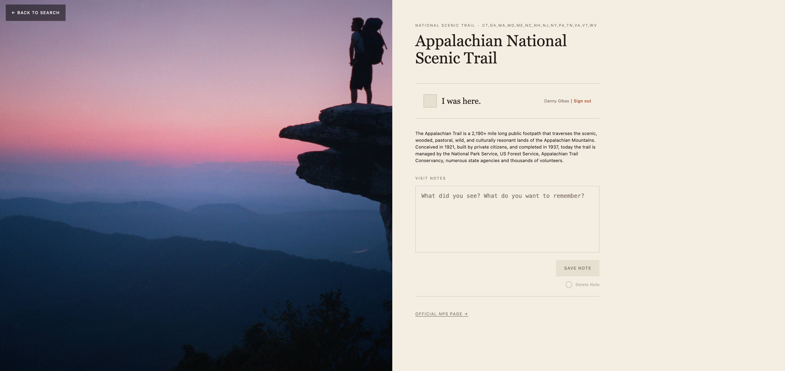
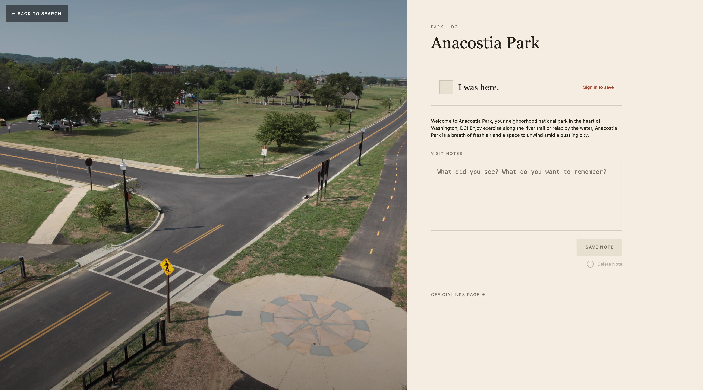

# Cairn

A Vue 3 log of U.S. national parks you’ve visited. Search uses the [National Park Service API](https://www.nps.gov/subjects/developer/get-started.htm). Auth uses [Supabase](https://supabase.com/).



## Setup

```bash
npm install
cp .env.example .env
```

Fill in `.env`, then:

```bash
npm run dev
```

Restart `npm run dev` after any `.env` change. `.env` is gitignored — never commit real keys.

### NPS API key

Park search needs an NPS API key. The key is **not** in this repo.

1. Request a free key: [Get Started with the NPS API](https://www.nps.gov/subjects/developer/get-started.htm)
2. Set it in `.env` (**no** `VITE_` prefix — that would bake it into the browser bundle):

```
NPS_API_KEY=your_key_here
```

Local requests go to `/nps`. Vite’s proxy forwards them to `developer.nps.gov` and attaches `X-Api-Key`.

### Supabase Auth

Sign-in / sign-up use Supabase Email auth. You need your own free project.

1. Create a project at [supabase.com](https://supabase.com/)
2. **Authentication → Providers → Email** — enabled
3. For local dev, you can leave **Confirm email** on (the app shows a “check your email” step) or turn it off for faster testing
4. **Authentication → URL Configuration** — set Site URL to `http://localhost:5173` (or your Vite port) and add the same under Redirect URLs
5. Project **Settings → API** — copy the Project URL and the **publishable** (anon) key into `.env`:

```
VITE_SUPABASE_URL=https://your-project.supabase.co
VITE_SUPABASE_ANON_KEY=your_publishable_key
```

These use the `VITE_` prefix on purpose — they are public client config. Do **not** put the secret / service_role key in the Vue app.

## Backlog

See also `~/Desktop/career gameplan/39-parkkeep.md`.

- [ ] Disable visit checkbox + notes when logged out; click opens sign-in modal
- [x] Auth service (Supabase email sign-in / sign-up)
- [ ] Database service (visits table + RLS)
- [ ] NPS caching (stay under ~1000 calls/day; key server-side only)
- [x] Sign-in modal/drawer
- [ ] ParkCard marker when item has notes (visited badge already exists)
- [ ] Save/delete error handling — fail: keep note / keep Save enabled for retry; show error; mutate UI only on success
